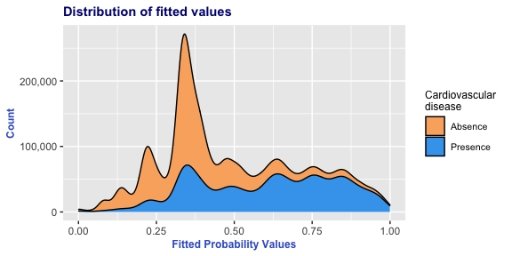

Statement of goals
------------------

Based on a report published by Centers for Disease Control and
Prevention, about 610,000 people die of heart disease in the United
States every year: that is 1 in every 4 deaths. Moreover, more than half
of the deaths due to heart disease in 2009 were in men.

Men are usually more prone to heart diseases compared to women. So, in
this project we aim to answer below questions by exploring data:

1.  Are men more prone to cardiovascular diseases as compared to women?
2.  What variables explain heart disease better for women than men, and
    vice versa?

Data Description
----------------

To answer our research questions, we intend to use [Cardiovascular
Disease](https://www.kaggle.com/sulianova/cardiovascular-disease-dataset)
dataset from Kaggle

The dataset consists of 70,000 records of patient’s data in 11 features,
such as age, gender, systolic blood pressure, diastolic blood pressure,
and etc. The target class “cardio” equals to 1, when patient has
cardiovascular disease, and it’s 0, if patient is healthy.

There are 3 types of input features:

-   Objective: factual information
-   Examination: results of medical examination
-   Subjective: information given by the patient.

More information on this data:

-   As per the data source, it is collected at the moment of medical
    examination
-   But from our analysis this seems to be more synthetically generated
    as most of the data is equally distributed for almost all the
    variables in it, which is generally not realistic. Also,
    surprisingly there is more female data
    -   In this data, number of people people with cardiovascular
        disease are 34,979 and without are 35,021
    -   65% of this data has female population (45,530) and remaining
        are male population (24,470)
    -   49.7% of female have heart disease and 50.5% of male have heart
        disease
-   There are outliers in both blood pressure columns.
    -   With minimum as low as -150 and maximum as high as 16020
    -   Blood pressure outside the range 0-400 means person is either
        dead or just about to die
    -   We have removed records with these outliers from the data

Data Exploration
----------------

Interestingly, this data has 3 types of features such as objective,
examination and subjective. We have explored all of these variables for
both male and female in the view of cardiovascular disease presence.
Most of these features are equally/similarly distributed for both men
and women (see Apendix). To continue our research on this data and based
on our intuition as well as domain knowledge we have chosen five main
features to see if they explain heart disease comparison for both the
gender. These five varibles are height, weight, systolic blood pressure,
cholestrol, and physical activity. By choosing these features, we also
cover 3 types of features mentioned above.

Reason for us to choose these variables:

-   Intuition or from experience from seeing heart patients earlier:
    -   Variables: Height(positive effect) and Weight(negative effect)
-   Research says that there is correlation between systolic blood
    pressure and cardiovascular risk
    -   Reference link:
        <a href="https://www.ncbi.nlm.nih.gov/pubmed/12556653" class="uri">https://www.ncbi.nlm.nih.gov/pubmed/12556653</a>
-   Data Exploration: Outcome of variables explored to see better
    explaination for heart disease in both gender(see Apendix)
    -   Variables: cholestrol, and physical activity

***Let us see if there are any variations in each of these variables
from this data***

***Quantitative Variables***

-   Above plot is stacked for better visualization of the distribution.
-   For instace, the proportion of disease absent female values we see
    here are an addition to corresponding disease present value. E.g.,
    Peak for male with disease present is approx 0.075 which is almost
    equal for male disease absent case actual proportion
-   Mean of height in this population is 164.36 cm
-   Peak in the data for female is at mean height, whereas for men it is
    above mean height

-   Mean weight of overall population is 74.1 kgs
-   Both male and female have a peak in weight at approx. 70 kgs
-   Again for both gender, as the weight increases people with heart
    disease are more than people without

-   Above plot shows what proportion of each gender have cardiovascular
    disease or no at each systolic blood pressure
-   Normal Systolic Blood pressure is 120
-   Average Systolic Blood pressure is slightly higher than normal
-   People with abnormal systolic blood pressure are more prone to
    cardiovascular disease
-   For women, there are high chances of having heart diseases even
    below normal blood pressure

***Summary from these quantitative features***

-   Men are more taller than women, but that does not show any relation
    with heart disease
-   For both gender, more the weight higher the chance of heart disease
-   For women, there are higher chances of having heart diseases even
    below normal blood pressure \[Refer Appendix end of the Document\]

***Categorical Variables***

-   In both men and women, if the cholesterol is not normal then there
    are more number of heart disease cases
-   26% of women do not have normal cholesterol, whereas for men it is
    23%

-   This is a subjective variable i.e., answered by patients so might
    not be correct always but here we assume it to be correct
-   80% of both men and women are active
-   If one is inactive there are slightly higher chances of having heart
    disease

***Summary from these categorical features***

-   In fact, there is no much difference in men and women in this data
    for both cholesterol levels and physical activity
-   But these features have explaination for a person to have or get
    heart disease
-   So we continue to have these variables in the model

Modeling
--------

    ## # A tibble: 2 x 2
    ##   gender `mean(.fitted)`
    ##   <fct>            <dbl>
    ## 1 Female           0.492
    ## 2 Male             0.500

-   We have used a logistic regression model to predict the chance of
    having a heart disease using the important varibales selected
-   Initially, we have built 2 separate models for men and women to see
    if the variables of importance or coefficent values change. We
    observed that there was no difference in those two different models
-   So, we have decided to have one single model for both the gender and
    see what’s the importance of gender
-   As we see, the coefficient for gender is as small as -0.04 showing
    that this is not a very important variable in predicting chance of
    heart disease
-   In other variables, cholesterol and activen feature seem to be of
    more importance. But these are our categorical variables
-   Height and Active features have negative correlation with the chance
    of getting heart disease
-   Whereas, if one is having high values in systolic blood pressure,
    weight and cholestorol then he/she is more prone to heart disease

<!-- -->

    ## [1] "Accuracy"
    
    ## [1] 72.06349

-   Though the accuracy is good enough, the distribution of probability
    values for both the classes seems to be not great
-   Although this is not a perfect model we wish to have, it is one of
    the best fit model using this data to predict heart disease. We have
    tried several models, gender specific as well as using objective,
    examination and subjective features separately. None of them were
    promising as this one.

-   These fit plots clearly show that although these features are good
    enough to predict heart disease, they are not able to differentiate
    the chance of heart disease for men and women.
-   Therefore, these models and data are not apt to find the determining
    factors for gender specific reasons to cardiovascular disease

Conclusion
----------

From the results above, we can see that the impact of variables on men
and women is no different. But this is no true in reality. The reason
for us to fail to answer this question properly is the data. The problem
with the data is that all the variables are equally distributed both
conditioned on gender and with out any condition, which is very weird in
reality. From this observation, the doubt arises that this data is most
likely fake or simulated for some other purpose. Therefore, we cannot
say that men and women have equal chances of heart disease and reasons
for them getting any cardiovascular ailment are same. We need to use
some realistic heart disease data for this kind of research witha great
deal of understanding its source and sampling if any. Once we have good
data, we can follow the steps laid out in this project to confirm or
deny our fundamental hypothesis.

Appendix
--------

***Exploring all the variables***

-   \#People with and without cardiovascular disease in the given
    dataset are almost equal
-   Absence = 35,021 and Presence = 34,979

Now lets explore each variable w.r.t Gender and cardiovascular disease

-   65% of this data has female population (count = 45,530) and
    remaining are male population (count = 24,470)
-   There is a equal distribution of people with heart disease in both
    the genders
-   49.7% of female have heart disease and 50.5% of male have heart
    disease

In this data, there are 3 types of input features:

-   Objective: factual information;
-   Examination: results of medical examination;
-   Subjective: information given by the patient.

***First let us look at objective features distribution conditioned on
gender***

-   Peak in female is between 155 to 165 cm approximately
-   Whereas in male the peak of data is above 165 cm
-   Women with height above 160 cm are less prone to cardiovascular
    disease

-   All of the heart disease patients in both male and female are above
    35 years of age
-   Very minute number of instances of people without heart disease in
    both gender have age below 30 years
-   After the age of 55, in both male and female number of people with
    heart disease are more

-   There more number of people with heart disease when weight is above
    70 kgs for women
-   For men, when the weight is over 75 kgs people with heart disease
    are more

***Summary of Objective features***

-   Taller women seem to be less prone to heart disease which is not
    exactly the case with men
-   Irrespective of gender elderly people (&gt;55 yrs) are more prone to
    heart disease
-   After a threshold of weight, count of men and women with heart
    disease is more. Threshold for women is on lower side compared to
    men

***Now let us explore, Examination features - which are results of
medical examination***

-   Normal Systolic Blood pressure is 120
-   There is a peak in both male and female at normal blood pressure
-   People with abnormal systolic blood pressure are more prone to
    cardiovascular disease

-   Normal Diastolic Blood pressure is 80
-   In both male and female, peak in the distribution is at normal
    diastolic blood pressure
-   Specifically, at 90 mmHg of Diastolic Blood pressure there very high
    number of heart patients in both male and female. But above 90
    that’s not the case

-   In both male and female, there are more heart patients with abnormal
    cholestrol

-   Similarly, when there is abnormal glucose levels, there are more
    heart patients in both male and female

***Summary of Examination features***

-   For both male and female, when there are abnormal high values in any
    of the examination features, there is high chance of heart disease

***Now we analyse Subjective features***

-   In male, less number of smokers have heart disease compared to
    smokers. While for females it is equally distributed
-   Non smoker female are less prone to heart disease whereas non-smoker
    male are more prone to heart disease

-   This is almost similar to smoker vs non-smoker

-   Irrespective of gender, high number of people with less heart
    disease where there is more physical activity

***Summary of Subjective Features***

-   Smoking and Alcohol do not seem to be the reason for heart disease
-   On the otherhand, less physical activity may have more chances of
    heart disease

